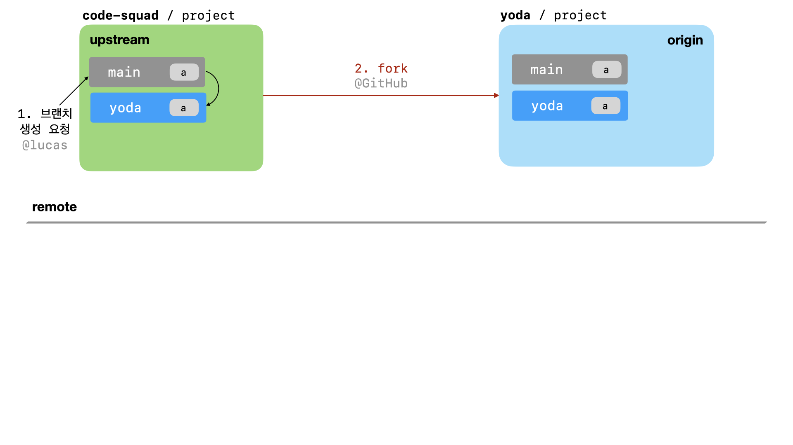
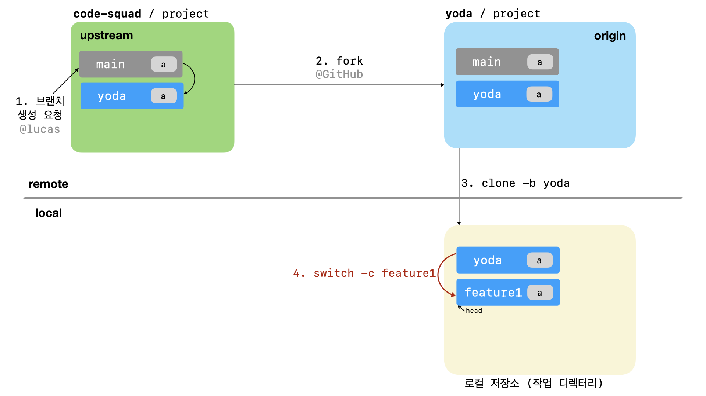

# common-mit
CS16 공통 프로젝트 저장소

## 목차
- [학습목표](#학습목표)
- [mit 명령어](#mit-명령어)

## 학습목표
- [x] [git](#git)
- [x] [git add](#git-add)
- [x] [git commit](#git-commit)
- [x] [git push](#git-push)
- [x] [Pull Request 운영 방식](#Pull-Request-운영-방식)

## git
- 소스코드를 효과적으로 관리하기 위해 개발된 `분산형 버전 관리 시스템`

## git add
- 작업 디렉토리에 있는 untracked 상태의 파일들을 스테이징하여 staged 상태로 변하게 하는 명령어
- commit을 위한 준비단계

### git add 명령어 형식
```shell
$ git add [파일]
```

### git add 예제
```shell
$ git add hello.txt # hello.txt 파일을 staged 상태로 변경
$ git add . # 현재 디렉토리의 모든 파일을 staged 상태로 변경
```

## git commit
- 이전 버전의 커밋부터 시작하여 변경된 점에 대해서 기록하는 명령어

### git commit 명령어 형식
```shell
$ git commit [-m "메시지 내용"]
```

### git commit 명령어 예제
```shell
$ git add .
$ git commit -m "feat: hello.txt 추가"
```
```shell
$ git commit
feat: hello.txt 추가

hello.txt 파일을 추가하였습니다.
```

## git push
- git에서 기록한 커밋들을 원격 저장소에 업로드하는 명령어

### git push 명령어 형식
```shell
$ git push [원격저장소 주소] [원격저장소 브랜치]
```

### git push 명령어 예제
```shell
$ git push origin main
```
- origin 저장소에 있는 main 브랜치에 현재 브랜치의 커밋들을 업로드합니다.

## Pull Request 운영 방식
1. GitHub 프로젝트 저장소에 자신의 브랜치가 있는지 확인합니다.
   - 브랜치가 없다면 브랜치 생성 요청을 합니다.


2. 프로젝트를 자신의 계정으로 `fork`합니다.



3. `fork`한 프로제긑를 자신의 컴퓨터로 `clone`한 후 디렉토리로 이동합니다.
```shell
$ git clone -b {브랜치 이름} --single-branch https://github.com/{본인 아이디}/{저장소 아이디}
$ git clone -b yoda --single-branch https://github.com/yoda/project
```
- --single-branch 옵션으로 인하여 fork한 원격 저장소에서 yoda 브랜치만 복사합니다.


4. 기능을 구현을 위해서 새로운 브랜치를 생성합니다.
```shell
# git switch -c {브랜치 이름}
$ git switch -c feature1
```



5. 기능 구현후 add, commit
```shell
$ git status
$ git rm {파일명} # 파일을 untracked 상태로 변경
$ git add {파일명} # 스테이지 상태로 변경
$ git commit -m "커밋 메시지"
```


6. push 명령으로 본인의 원격 저장소(origin)에 업로드합니다.
```shell
# git push origin {브랜치명}
$ git push origin feature1
```


7. GitHub 서비스에서 원본 저장소 프로젝트에 Pull Request를 보냅니다.
Pull Request는 원본 저장소(upstream)의 브랜치(yoda)를 기준으로
앞 단계에서 생성한 브랜치(feature1) 차이를 비교하도록 요청합니다.

예를 들어 code-suad/project yoda 브랜치를 base로 yoda/project feature1
브랜치와 비교합니다.


8. 리뷰어는 리모트(upstream) 저장소에서 PR 리뷰를 마무리하고 승인(approved)합니다.


9. `merge`가 완료되었다는 통보를 받으면 head 브랜치를 변경하고 작업 브랜치를 삭제합니다.
```shell
# git switch {브랜치 이름}
$ git switch yoda
# git branch -D {삭제할 브랜치 이름}
$ git branch -D feature1
```


10. `merge`한 codesquad 저장소 : 브랜치를 동기화하기 위해서 codesquad 저장소의 자기
브랜치를 추가합니다.
    - remote -v 명령어로 upstream 등록을 한번만 확인합니다.
```shell
# git remote add -t {아이디_브랜치_이름} {저장소 별칭} base_저장소_url
$ git remote add -t yoda upstream https://github.com/code-squad/project.git
$ git remote -v # 원격 저장소 목록 확인
```
- -t : 동기화할 브랜치 선택


11. codesquad 저장소에서 자기 브랜치 정보 가져옵니다.
```shell
# git fetch upstream {아이디_브랜치_이름}
$ git fetch upstream yoda
```


12. codesquad 원격(upstream) 저장소 브랜치와 동기화합니다.
```shell
# git rebase upstream/{아이디_브랜치_이름}
$ git rebase upstream/yoda
```


13. 원격 오리진(origin) 저장소 브랜치 업로드
```shell
# git push {원격저장소 주소 또는 별칭} {아이디_브랜치_이름}
$ git push origin yoda
```


14. 4단계부터 다시 진행합니다.


# mit 명령어
## mit 명령어 - 기능 요구 사항
- 파일들의 버전 관리를 위한 mit 명령어 구현

### mit 명령어 형식
```shell
$ mit 명령어 디렉토리명

$ mit list /Work/Masters/
$ mit list /Work/Masters
$ mit hash /Work/Masters/
$ mit zlib /Work/Masters/
```

### mit 명령어 종류
- `list` : 해당 디렉토리의 파일 목록을 출력
- `hash` : 해당 디렉토리의 파일들의 hash를 출력
- `zlib` : 해당 디렉토리의 파일들을 zlib로 압축
- `exit` : 애플리케이션을 종료합니다.

## mit 명령어 - 프로그래밍 요구 사항
- 디렉토리명은 디렉토리이름으로 끝나거나 `/`로 끝날 수 있습니다.
  - 예를 들어 `/Work/Masters/` 또는 `/Work/Masters`가 디렉토리명이 될 수 있습니다.
- mit 명령어의 디렉토리 입력이 파일이거나 디렉토리이지만 안에 파일이 없는 경우 "경고 메시지"를 출력후 다시 입력하게 합니다.
- `mit list` 명령어 실행시 출력되는 파일들의 크기는 KB 단위로 소수점 2번째자리까지 출력합니다.
  - ex) a.java 파일이 142byte인 경우 "a.java 0.14KB"와 같이 출력됩니다.
- 디렉토리 탐색시 해당 위치에 또 다른 디렉토리가 존재할때 재귀적으로 탐색하지 않습니다.
  - ex) "./Work/" 디렉토리에 Masters 디렉토리가 저장되어 있고 Masters 디렉토리에 a.java 파일이 있다면
  a.java 파일을 탐색하지 않습니다.

## mit 명령어 - 동작예시
```shell
> mit list ./Work/Masters
a.java 0.14KB
Person.java 0.35KB

> mit hash ./Work/Masters
a.java = 96831b0e7ba1a6f4ec183f2d4f011154f270050169ae24e5a9a6ede7097407a4
Person.java = b282f862b97920376e9d34d11ac27c0c2d813b61977fd4d27a91ff3b44e26fa9

> mit zlib ./Work/Masters
a.java.z 0.07KB
Person.java.z 0.0175KB

> mit list
유효하지 않은 명령어입니다. 형식 : mit list|hash|zlib 디렉터리명

> mit list ./Work
디렉토리가 비어있습니다. : ./Work

> mit list ./Work/Masters/a
입력하신 디렉토리명은 디렉토리가 아닙니다. : ./Work/Masters/a

> mit list ./Work/Masters/a.java
입력하신 디렉토리명은 디렉토리가 아닙니다. : ./Work/Masters/a.java

> exit
프로그램을 종료합니다.
```